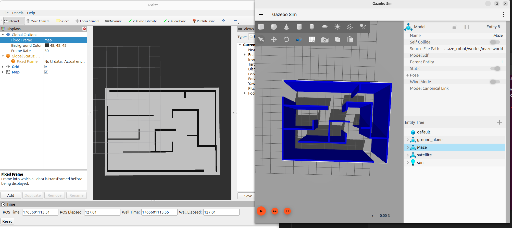

# CSCI 4551 Project

## Member:
Yang Liu, Haotian Zhai, Brian Vo

## Building
```
mkdir -p ~/mazebot_ws 
cd ~/mazebot_ws
git clone https://github.com/lamb97/cs4551-maze_robot.git
cd ~/mazebot_ws/src 
colcon build
source install/setup.bash
```
## Mazesolve
```
#Terminal 1
ros2 run maze_robot maze_map_publisher --ros-args   -p sdf_path:="your world path"   -p resolution:=0.1   -p model_name:="Maze or maze_2"
#Terminal 2
ros2 launch maze_robot world_turtlebot3.launch.py
#Terminal 3 
ros2 run maze_robot path_planner_node
#Terminal 4 
#open a new terminal
rviz2
 
```

## World2Grid
```
#Terminal 1
ros2 run maze_robot maze_map_publisher --ros-args   -p sdf_path:="your world path"   -p resolution:=0.1   -p model_name:="Maze or maze_2"
#Terminal 2
ros2 launch maze_robot world_turtlebot3.launch.py
#Terminal 3 
ros2 run maze_robot path_planner_node
#Terminal 4 
#open a new terminal
rviz2
 
```

