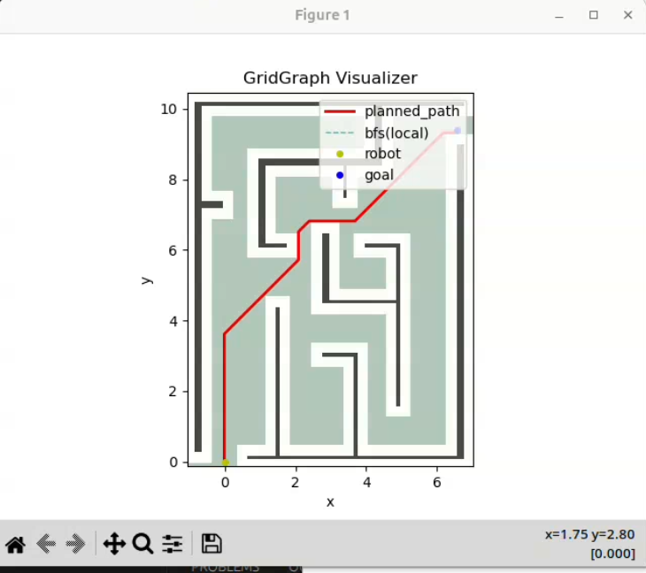

# CSCI 4551 Project

## Member:
Yang Liu, Haotian Zhai, Brian Vo

## Building
```
mkdir -p ~/mazebot_ws 
cd ~/mazebot_ws
mkdir src
cd src 
git clone https://github.com/lamb97/cs4551-maze_robot.git
cd ..
colcon build
source ~/mazebot_ws/install/setup.bash

```

## Maze_robot
```
ros2 run maze_robot grid_graph_visualizer -- --map-display raw

# open a new terminal
ros2 launch maze_robot maze_navigation.launch.py
 
```


